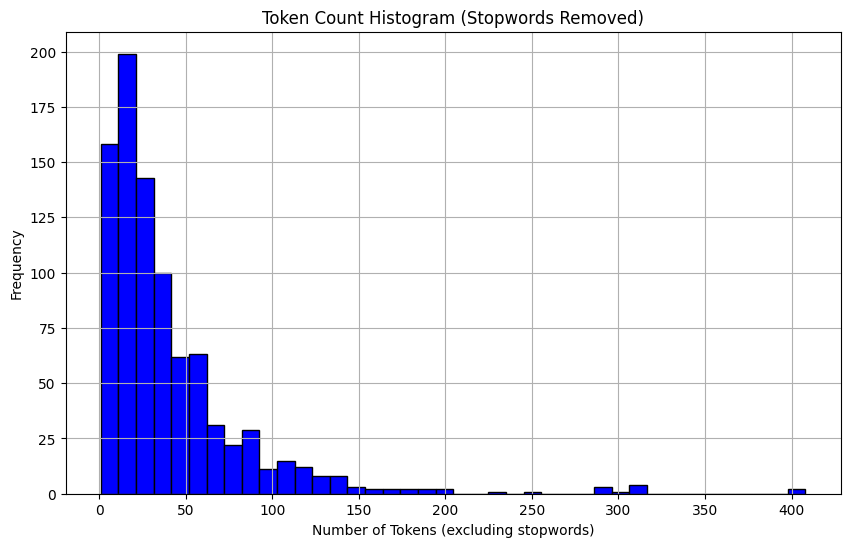
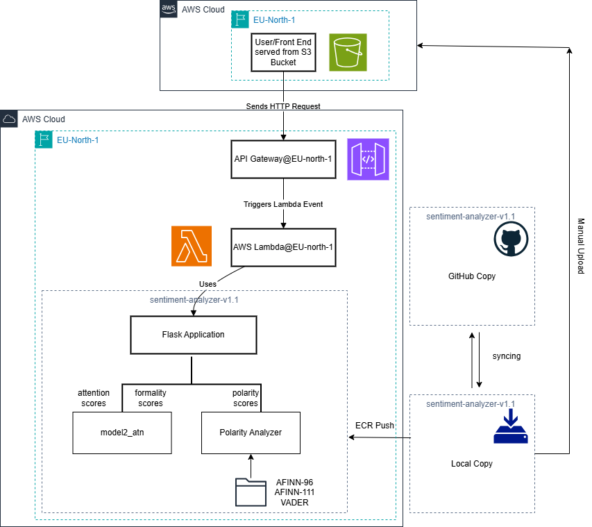
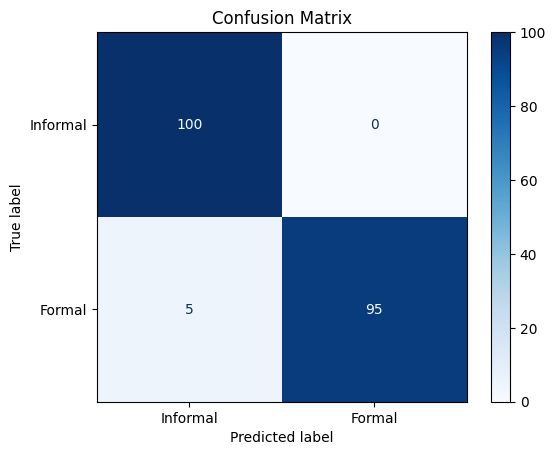
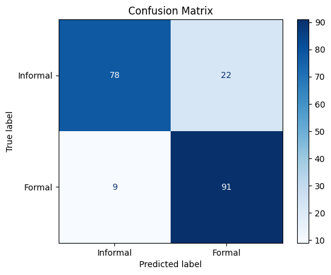
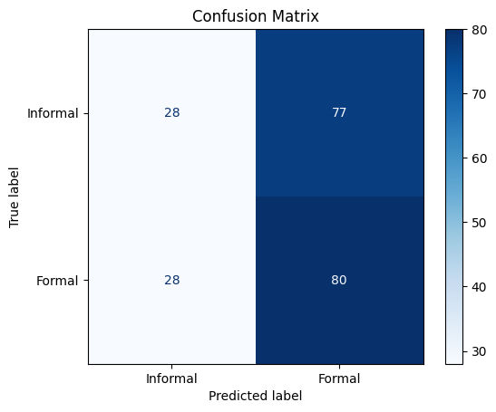

## 📝 Project Intro

I am happy to present a simple Flask based web-application for analysis of sentiment of text. This application is very useful for fast and surface level sentiment analysis of e-mails, passages and paragraphs. One of main reasons for developing this web application is to demonstrate that even basic and lightweight machine learning models can perform quite well for certain tasks without need to load and finetune LLMs that usually require either expensive hardware or API subscription to utilize. The light-weight application has 2 main functionalities as of July 2025: performing a sentiment analysis of the text by its polarity (whether the text conveys positive or negative sentiment) using a lexicon-based approach utilizing lexicons like VADER and AFINN and performing an analysis of the formality level of a given text and highlighting the words with colour that changes its hue based on their contribution to the final formality assessment. The formality score is calculated based on bidirectional LSTM that was trained on the ENRON mail dataset. Because lexicon based models don’t require any training procedure, we discussed training pipeline only for the BiLSTM based formality classifier. A manual labelling procedure was called for since ENRON dataset that is used to train the formality classifier doesn’t include labels for formality. 3 independent labellers made sure that the annotations for the samples in the training set are as objective as possible.

## 📄 Dataset Preparation & Overview

The training set is based on the publicly available ENRON email corpus, which contains over 500,000 emails from the ENRON company prior to its collapse in 2001. This corpus is widely used in natural language processing research due to its authenticity as a source of corporate communication patterns.

Emails were included in partitions to ensure diversity in content and balance between the classes formal and informal. Messages containing only links, spam, or mostly numerical/graphical content were excluded from the selection process.

Since labeling the entire corpus was not feasible, a systematic sampling approach was followed. We created 10 balanced splits of 150 messages each, totaling 1,500 labeled messages. Three human annotators individually labeled each message as formal or informal. Cases of disagreement were resolved through consensus-building sessions to ensure high-quality annotations. This sampling approach maintained class balance and ensured variation in formality across all partitions.

The ENRON corpus introduced challenges due to the prevalence of threaded conversations, where multiple replies in a single thread may differ in formality. To avoid ambiguous supervision signals, messages were isolated so that each training instance corresponded to a single, self-contained email. This ensured cleaner and more reliable training signals for the model.

🧹 Data Preprocessing Steps

1. Tokenization: Split user input into tokens using nltk.word_tokenize.
2.Stopword Removal: Removed common English stopwords.
3.Word Embedding: Used the GloVe-Twitter-25 model to embed each token into a 25-dimensional vector. Inputs were clipped to a maximum of 100 tokens.

A lightweight embedding model was chosen to maintain efficiency given the limited dataset size and computational resources, while still preserving meaningful semantic information from the text.

## 🏗️ The ML Model 

Our formality classifier combines bidirectional LSTM processing with attention mechanisms to deliver both accurate predictions and interpretable results. The bidirectional architecture captures contextual relationships from both directions in the text, while the attention mechanism identifies which specific words most strongly indicate formal or informal language. This design philosophy prioritizes interpretability alongside performance. Users receive not only formality scores but also visual feedback highlighting the words that most influenced the prediction. The attention weights enable the application to color-code text based on each word's contribution to the overall formality assessment. The architecture represents a lightweight alternative to large language models, achieving strong performance with significantly lower computational requirements.

## 🏗️ The Deployment Architecture

The model inference is implemented entirely in Python. API Gateway is configured to expose the Lambda function as a RESTful API endpoint, enabling external clients to send HTTP requests to the model service. The entire backend is dockerized and pushed into ECR (Elastic Container Registry). The frontend sends HTTP requests the RESTful API endpoint and triggers an event for the Lambda function. The lambda function uses the lambda handler to interface between the event and the backend code from the docker image.

Because the frontend receives the model predictions from the exposed endpoint outside of its origin, the response generated by Lambda function should contain appropriate CORS headers. Otherwise the responses coming from the REST API will be blocked by default by the browser as a part of security policy.

The HTTP request sent from frontend travels through the public internet before reaching the publicly exposed REST API. For obvious security reasons in the future implementations a scheme where the request doesn’t leave the AWS internal network will be implemented.

## 🧪 Testing / Simulation Results

To test the performance of the sentiment classification 200 emails, each approximately 50 words long, were generated by Claude 4.0 Sonnet. Half of these emails were formal and the other half was informal. Mails from each class had different degrees of formalities to test the ability of the model to deal with formalities of different degrees. Additionally, a variability of the content among the samples was ensured to allow better coverage of the test set.

  
  

The test results for the test set that contained 50 word mails on average tell us that the model has 84.5 percent accuracy that can be considered pretty good. The recall with 91 percent is better that than precision that is 0.805. With the assumption that the formal mail are labelled as 1, these numbers suggest that the model has a slightly better performance in recognizing formal emails correctly than informal ones. The logit distribution graph of the samples from both of the classes reveals this difference a little bit more: the distribution of the logits for the formal emails has a lower deviation around the peak thus a smaller percentage of formal emails are assigned a logit below 0 (predicted as informal).
## 🧹 Other Technical Considerations and Edge Case Evaluation

To better demonstrate the ability of the formality classifier to handle edge cases, we generated various sentence lists of 100 50-word sentences having following properties that aim to test the robustness of the sentiment classifier handling ambigious and confusing text:

- Formal sentences that are formal despite some words that can be also used in informal contexts.
- Informal sentences that are written in formal language but carry sarcastic tone so are informal in reality.
- Sentences with any other confusion structure that can confuse the model to make erroneous predictions.

## ⚡ Points for Improvement
User star-rating system: A feedback mechanism where users can rate the assesments made by the application is planned for future versions. This can reveal not only the content on which the model gave the least satisfactory performance but also ways to finetune and improve the user satisfaction.
More sentiment types, multimodal capabilities: New sentiment analysis types and multimodal capabilities are planned for future releases.

